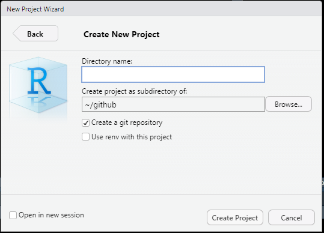
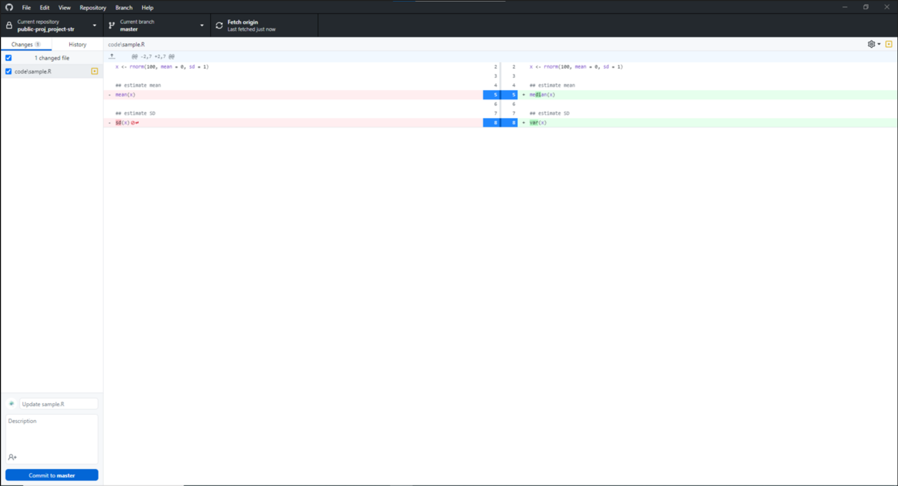

再現性のあるコーディングはとても重要だが、整理の仕方をまとめたものがほとんどない。個人の好みが大きく出るところだが、自然選択を経て私が到達したレポジトリの作り方をまとめてみる。前提条件としてR Studioを使っていることを想定するが、そうでなくとも基本構造は使える。

## フレームワーク

**ローカル（自分のパソコン）**と**オンラインレポジトリ（Github）**を連携する環境を作る。変更履歴を残しながらオンラインレポジトリに保存することで、デバッグ（エラーがないかチェックすること）・再現・シェアしやすくなる。大枠としては以下：

1.  レポジトリ（コードなど）を編集する

2.  変更履歴をGitに記録する（コミット）

3.  編集をGithubに反映する（プッシュ）

4.  １に戻る

## 事前準備：Github/Gitの環境構築

[Happy Git and GitHub for the useR](https://happygitwithr.com/index.html)がかなり丁寧にまとめてくれているので、こちらをぜひ一読してほしい。以下は最低限の環境構築の手順を説明する。

1.  [Github](https://github.com/)でアカウントをつくり、オンラインでのストレージ先を確保する。このアカウント名はレポジトリのリンクに必ず含まれるので、極端に長いものや、大文字を含むものは避けたい。このアカウントにローカルで作成したレポジトリを追加する。基本、Github上でレポジトリは編集せず、ローカルで編集したものをオンラインにプッシュする形で更新する。

2.  [Git](https://git-scm.com/)をインストールする。ローカルで機能するもので、編集履歴を自動管理するための装置（バージョンコントロールシステム）である。Gitでは、コミットすることで編集履歴を記録してくれる。変更箇所は自動認知してくれるため、この作業が非常に楽になる。基本デフォルトの設定のままインストールすれば問題ないが、念のため[こちら](https://happygitwithr.com/install-git.html)を読んでおくといいかもしれない。

3.  Git clientをインストールする。Gitはターミナルから直接操作もできるが、ややとっつきにくい。そこで、操作しやすいGUIを提供してくれる[Github Desktop](https://desktop.github.com/)をここでは使うことにする。ほかの選択肢については[こちら](https://happygitwithr.com/git-client.html)を参照するとよい。

## 事前準備：Projectをつくる

Gitの環境構築が済んだらProjectを作る（メニューバーの`File > New Project > New Directory > New Project` ）。**このとき、以下のウインドウで**`Create a git repository`**にチェックし忘れないようにする。**このProjectに論文一つの必要情報をすべて入れる（生データ、コード、論文原稿）。



プロジェクトは、初期ファイルとして以下のファイルを含んでいる。

-   `project_name.Rproj`: プロジェクトのメタデータファイルのようなもの。プロジェクトを開きたいときはこれを開く。プロジェクトが開かれている場合は、R Studio右上に`project_name`がみえる。開いていない場合は`Project: (None)`となる。

-   `.gitignore`: Gitで変更履歴を追いたくないファイルを指定するためのファイル。デフォルトでいくつか入っている。 細かい使い方はGoogleに。

プロジェクト管理することのメリットとして、デフォルトでプロジェクトフォルダがWorking directoryになっているので、いちいち`setwd()` を使う必要がない。違うプロジェクトに移りたければ`File > Open Project`で違うプロジェクトを開ける。

## 事前準備：Projectの内部構造

レポジトリの直下にファイルをどんどん入れていくと、醜いレポジトリになってしまう。そこで、いくつかサブフォルダを設けてファイルを整理する。私のオススメは以下：

-   `code` : Rのスクリプト（`.R`）を保存するフォルダ。

-   `data_raw`: 生データを保存するフォルダ。根本的な修正でない限り（入力ミスなど）、このフォルダのデータはいじらない。

-   `data_fmt`: Rで編集したデータを入れるフォルダ。解析にはこちらのデータを用いる。

-   `output`: アウトプットファイルを入れるフォルダ（Figureなど）

-   `rmd`: Rmarkdown用のフォルダ。私はRmarkdown[^1]でデータを呼び出しながら論文を書くので、ここに入れておくと非常に便利。Rmarkdownを使わない人はいらないかもしれない。

[^1]: Rmarkdownを解析用に使っている人をみるが、非常に危険。Rmarkdownはコードを埋め込みながらDocumentを作成するためのファイルフォーマットであり、解析用ではない。結果をまとめるならば、`source()` で適宜`.R`ファイルのコードを呼び出すとよい。

**また、ファイルの命名規則を作る**こと（**超大事**）。絶対に守るべきファイルの命名規則は以下：

-   大文字は使わない（`Figure.R` $\rightarrow$ `figure.R`)

-   単語の切れ目にはアンダースコア。スペースを**絶対に**使わない。（`figure fish.R` $\rightarrow$ `figure_fish.R`）

-   コードの用途に応じてPrefixを統一する。例：`figure_xxx.R`（Figure用）；`analysis_xxx.R` （統計解析用）；`format_xxx.R`（データ整理用）

-   データのファイル名も一貫したルールに則って名前を付ける。例：`data_fish.csv`, `data_env.csv` etc.

こうすれば各コードの用途が一目でわかるし、かつ同じ用途のファイルが名前でソートすると自動でまとまる。[こちらのレポジトリ](https://github.com/aterui/public-proj_fishery-stability)はこのような命名規則に則りファイルが管理してある。

## 編集する

試しに`code`に`.R`ファイルを作り、編集してみる。好きなコードを書いて、`test.R`として保存する。例えば：

```{r test1, eval=F}
x <- rnorm(100)
mean(x)
```

ファイルを保存したら、Github Desktopを開く。こんな画面になっていると思う。左上に"Current repository"という書いてあるので、これをクリックする。


すると、以下のように"Add"というボタンがでてくるので、これをクリック、`Add existing repository` を選ぶ。作成したR Projectのフォルダを選択する。


プロジェクトの選択が完了すると、フォルダ内にあるファイルがリストされるはず。

## コミットする

コミットすることで変更内容がGitに記録される。そのためには、（１）変更を記録したいファイルにチェックをいれ、（２）Commit Title（変更内容の要約）を記さなければならない。ここでは`Intial commit` とでもしておこう[^2]。Commit Titleを決めたら、画面左下の青いボタンをクリックするか、`Ctrl + Enter`でコミットできる。

[^2]: 2回目以降は、コミットの作業カテゴリを反映するようなInitial wordを使うと、のちのち作業履歴を追いやすくなる（[参考](https://gist.github.com/scmx/411f6fea4ee3832806720d536a7d5d8f)；例えば、`Edit: figure codes`など）。Gitはコミットごとに変更を記録しておくので、作業としてまとまりのあるものをこまめにコミットするとよい。この辺はググればリソースはたくさんある。


コミットしたら、R Studioに戻り、先ほどの`test.R`に以下のような変更を加え、ファイルを保存しよう。

```{r test2, eval=F}
x <- rnorm(100)
median(x) # changed from mean to median
```

そうすると、Github Desktopのほうで変更箇所が以下のようにハイライトされる。



再度Commit Titleを入力し（`Edit: test`とでもしよう)、コミットする。左カラムのタブをChangesからHistoryに変更すると、最初と今回のコミットが変更履歴とともに記録されているはずだ。

## プッシュする

コミットまではあくまで自身のパソコン内での作業になる。これをオンラインのGithubアカウントにプッシュすることで、コードをオンラインバックアップできるだけでなく、必要に応じて公開したり共同研究者とシェアできる（デフォルトでは非公開）。プッシュは以下の画像のオレンジ枠のところをクリックするか、`Ctrl + P` でできる。


初めてプッシュする場合は、オンラインにローカルと対応するレポジトリがないので、「新しいレポジトリをオンラインに作りますか？」と聞かれる。これにYesと答え、プッシュ（一回目のみPublishと書いてある）すればオンラインに対応するレポジトリができる（なお、空のサブフォルダは何かファイルをいれるまで無視される）。もし、Gitで変更履歴を追いたくないファイルがあれば（例えば巨大なGISファイルなど；Githubには一つあたり100MB以上のファイルは置けない）、`.gitignore`にファイル名を入れておけばよい。

## まとめ

今回ここに書いた内容を一通り覚えれば、最低限のことはできるはず。しかし、ほかにもフォーク、プルリクエスト、ブランチ[^3]など様々な機能が容易されており、これらを活用すればより快適なGithubライフを送ることができる。こうした基本的な使い方はウェブ上にたんまりとリソースがあるので、ぜひグーグル先生に聞いてみるといい（例えば[ここ](https://tech-camp.in/note/technology/4938/)）。私のグループでは、在籍者全員にこの程度はGit/Githubを扱えるようになってもらい、適宜コードにコメントもするようにしている（Githubにはコメント機能もある）。

[^3]: 例えば、ブランチは別の開発ラインを作ることに相当するが、こうした開発は元のファイルを維持したまま行うことができる。これにより、同じようなファイルの`XXXver1.R`などといったファイルが量産されることがなくなる。コードの編集が適切だと判断できた段階で変更を反映することができる。

最後に、論文を書く際に、コードを一緒に公開しない著者が多い。これは再現性の観点から好ましくないのはもちろんだが、私は**後で自分が何をやったのかわからなくなるのが何より嫌なので、プロジェクトの最初から最後まで履歴を残し、論文と一緒に最終版をPublishする。**つまり、自分の精神衛生のためにやっている。
